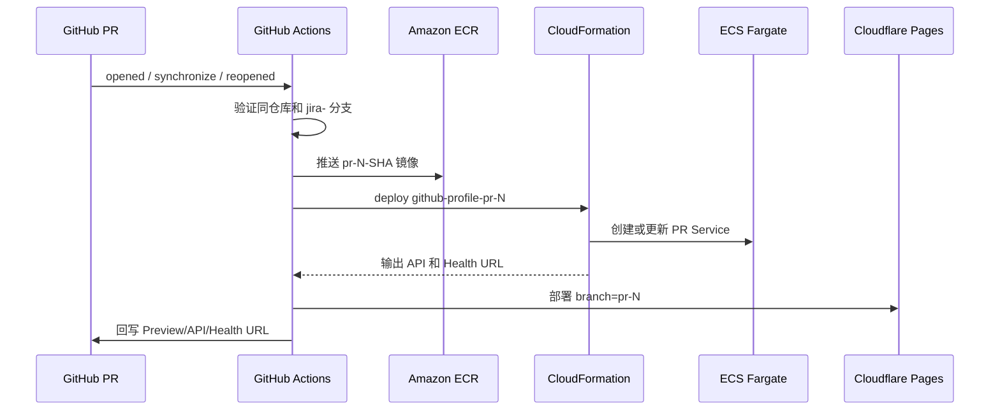
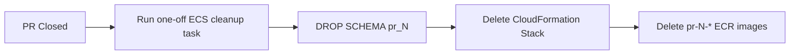

# GitHub Profile Manager 部署架构

## 1. 架构结论

本项目使用 GitHub Actions 直接完成 CI/CD，不依赖 CodeBuild：

```text
GitHub Pull Request
  -> PR Guard
  -> GitHub OIDC
  -> Docker Build
  -> Amazon ECR
  -> CloudFormation PR Stack
  -> ECS Fargate + ALB + Cloud Map
  -> Cloudflare Pages Preview
```

共享 VPC、ALB、ECS Cluster、RDS 和 Cloud Map Namespace。每个 PR 只创建应用层资源，并使用独立 PostgreSQL Schema。

## 2. 资源边界

### 共享资源

- VPC、Internet Gateway、单 NAT Gateway
- 公有 ALB 子网和私有 ECS/RDS 子网
- ECS Cluster
- ALB 和 HTTPS Listener
- Aurora PostgreSQL
- ECR Repository
- Cloud Map Private DNS Namespace
- Secrets Manager secrets
- ECS Task Role 和 Task Execution Role

### 每 PR CloudFormation Stack

Stack 名称：

```text
github-profile-pr-<PR_NUMBER>
```

Stack 内资源：

- ECS Task Definition
- ECS Fargate Service
- `ip` 类型 ALB Target Group
- `/pr-<PR_NUMBER>/*` Listener Rule
- Cloud Map Service
- CloudWatch Log Group

命名示例：

```text
ECS Service:      github-profile-pr-123
Target Group:     ghprof-pr-123-tg
Cloud Map DNS:    pr-123.github-profile-dev.local
Database Schema:  pr_123
ECR Tag:          pr-123-<GIT_SHA>
```

## 3. GitHub Repository Variables 与 SSM 配置

在 GitHub 仓库进入 `Settings -> Secrets and variables -> Actions -> Variables`，只配置三个入口变量：

```text
AWS_REGION
AWS_ROLE_ARN
SHARED_CONFIG_PARAMETER
```

示例：

```text
AWS_REGION=ap-northeast-1
AWS_ROLE_ARN=<GitHub OIDC Role ARN>
SHARED_CONFIG_PARAMETER=/github-profile/dev/deployment-config
```

在 AWS Systems Manager Parameter Store 创建一个 `String` 参数：

```text
Name: /github-profile/dev/deployment-config
Tier: Standard
Type: String
```

参数值使用以下 JSON，把占位符替换成控制台中的真实值：

```json
{
  "CLOUDFORMATION_ROLE_ARN": "<CloudFormation Service Role ARN>",
  "ECR_REPOSITORY": "github-profile-dev-backend",
  "ECS_CLUSTER": "github-profile-dev-ecs-cluster",
  "VPC_ID": "<VPC ID>",
  "PRIVATE_SUBNETS": "<PRIVATE SUBNET ID A>,<PRIVATE SUBNET ID B>",
  "ECS_SECURITY_GROUP": "<ECS SECURITY GROUP ID>",
  "ALB_LISTENER_ARN": "<HTTPS LISTENER ARN>",
  "API_ORIGIN": "https://api-dev.example.com",
  "CLOUD_MAP_NAMESPACE_ID": "<CLOUD MAP NAMESPACE ID>",
  "ECS_TASK_EXECUTION_ROLE_ARN": "<ECS TASK EXECUTION ROLE ARN>",
  "ECS_TASK_ROLE_ARN": "<ECS TASK ROLE ARN>",
  "RDS_SECRET_ARN": "<RDS SECRET ARN>",
  "TOKEN_ENCRYPTION_SECRET_ARN": "<TOKEN ENCRYPTION SECRET ARN>",
  "DB_HOST": "<RDS WRITER ENDPOINT>",
  "DB_NAME": "postgres",
  "RESOURCE_PREFIX": "github-profile",
  "DEPLOY_ENVIRONMENT": "dev",
  "CLOUDFLARE_PROJECT_NAME": "github-profile-frontend",
  "CLOUDFLARE_ACCOUNT_ID": "<CLOUDFLARE ACCOUNT ID>",
  "CLOUDFLARE_API_TOKEN_SECRET_ARN": "<CLOUDFLARE TOKEN SECRET ARN>"
}
```

`API_ORIGIN` 不包含结尾 `/`。Cloudflare Pages 是 HTTPS 页面，因此正式联调前必须给 ALB 配置 ACM 证书和 HTTPS Listener，避免浏览器阻止 HTTP API。

所有真实 ID、ARN 和域名放在 SSM deployment config；GitHub 只保存三个入口变量，仓库文件不保存真实资源标识。

## 4. Secrets Manager

应用所需敏感值继续保存在 AWS Secrets Manager：

```text
RDS 托管 Secret
github-profile/dev/token-encryption-key
github-profile/dev/cloudflare-api-token
```

`github-profile/dev/cloudflare-api-token` 的 SecretString 直接保存 Token 字符串，不包装为 JSON。GitHub Actions 只保存该 Secret 的 ARN，运行时通过 OIDC 临时凭证读取并进行日志掩码。

## 5. IAM 角色

### GitHub Actions OIDC Role

建议名称：

```text
github-profile-github-actions-oidc-role
```

职责：

- ECR 登录、推送和删除 PR 镜像
- 创建、更新、查询和删除指定前缀的 CloudFormation Stack
- `iam:PassRole` 到指定 CloudFormation Service Role
- 读取 `/github-profile/dev/deployment-config` SSM Parameter
- 读取 Cloudflare Token 对应的单个 Secret
- 为 Schema 清理执行受限的 `ecs:RunTask`、`ecs:DescribeTasks`
- 为 Schema 清理向 ECS 传递指定 Task Role 和 Task Execution Role

OIDC Trust Policy 必须同时限制：

```text
仓库：downMark/github-profile
分支或 pull_request subject
audience：sts.amazonaws.com
```

### CloudFormation Service Role

建议名称：

```text
github-profile-cloudformation-pr-role
```

信任主体：

```text
cloudformation.amazonaws.com
```

职责仅限带有项目/PR 命名约束的：

- ECS Service 和 Task Definition
- ELBv2 Target Group 和 Listener Rule
- Cloud Map Service
- CloudWatch Log Group
- `iam:PassRole` 到现有 ECS Task Role 和 Task Execution Role

不要给 GitHub OIDC Role 配置管理员权限，也不要在仓库提交 IAM Policy JSON。策略应在 AWS 控制台或后续独立的私有基础设施仓库管理。

## 6. PR 创建和更新链路



CloudFormation 使用 [infra/pr-environment.yaml](infra/pr-environment.yaml)，更新同一个 PR 时更新同一个 Stack，不会重复创建资源。

## 7. PR 关闭清理链路



Schema 清理失败时停止删除 Stack，避免静默遗留测试数据。修复问题后重新执行 cleanup job。

Cloudflare Pages 当前不允许删除某个分支的最新部署，因此关闭 PR 时只清理 AWS 和数据库资源；Pages 的旧部署使用单独的定期保留策略删除。

## 8. 访问链路

```mermaid
flowchart LR
    User[用户浏览器] --> Pages[Cloudflare Pages Preview]
    Pages --> HTTPS[HTTPS API 域名]
    HTTPS --> ALB[共享 ALB]
    ALB --> Rule[/pr-N/* Listener Rule]
    Rule --> TG[PR Target Group]
    TG --> ECS[PR ECS Fargate Task]
    ECS --> RDS[共享 RDS / Schema pr_N]
    Lambda[可选内部 Lambda] --> CloudMap[Cloud Map DNS]
    CloudMap --> ECS
```

Lambda 不放在公开请求的必经链路中。只有异步任务或内部消费者需要 Lambda 时，Lambda 才通过私有 DNS `pr-N.github-profile-dev.local` 调用 ECS。

## 9. 首次启用顺序

1. 为 ALB 配置 ACM 证书、443 Listener 和 80 到 443 重定向。
2. 创建 `github-profile-cloudformation-pr-role`。
3. 收紧并补全 GitHub OIDC Role 权限。
4. 创建 SSM deployment config，并在 GitHub 配置三个 Repository Variables。
5. 确认 Cloudflare Pages 项目已经创建，生产分支为 `main`。
6. 确认 Cloudflare Token SecretString 是原始 Token 字符串。
7. 从 `jira-<编号>` 分支创建 PR。
8. 检查 GitHub Actions、CloudFormation Events、ECS Service 和 ALB Target Health。
